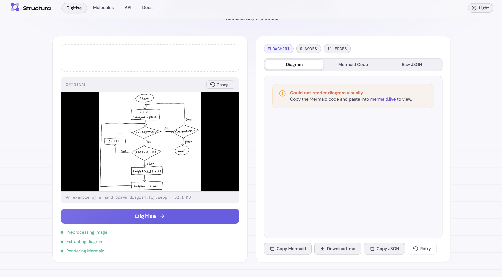
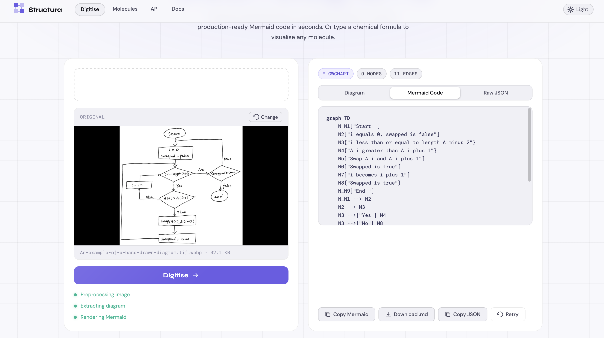
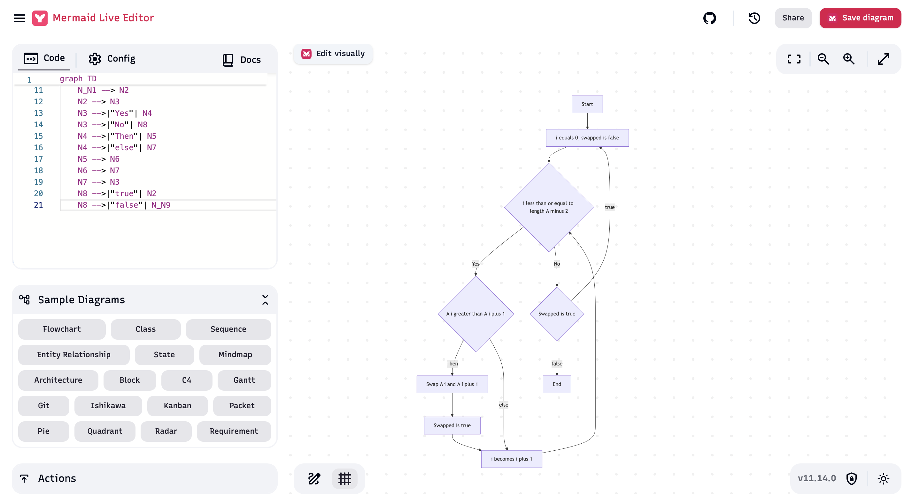
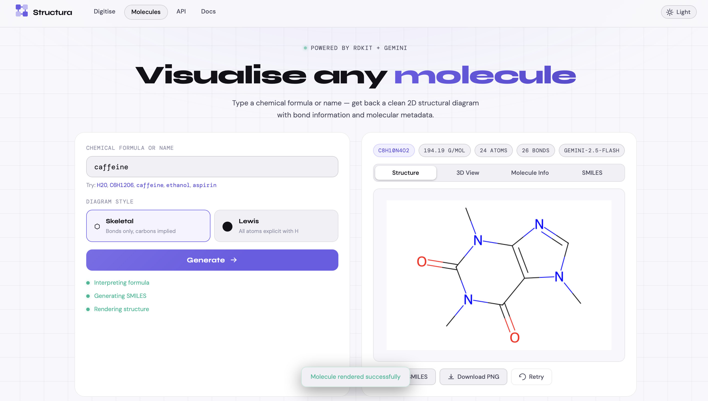
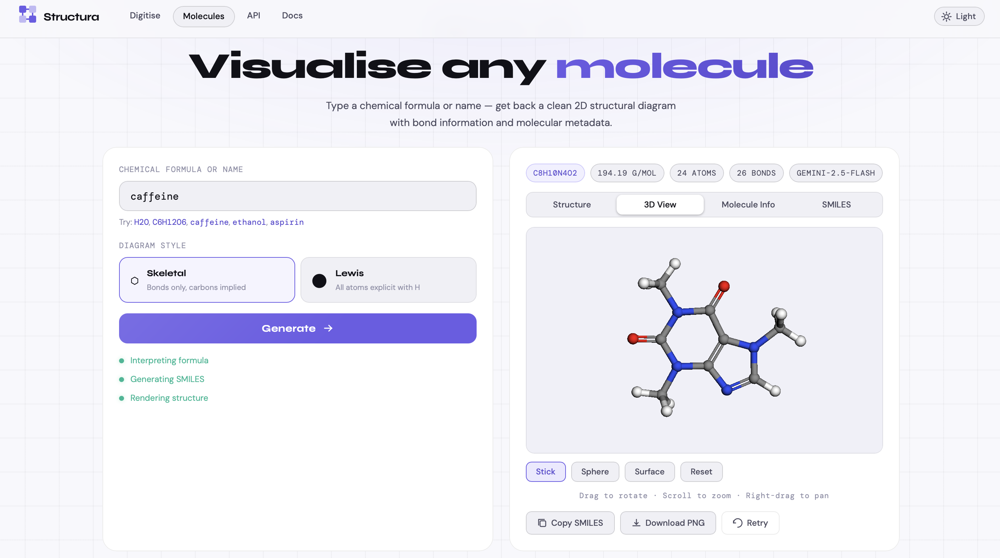

# Structura

> A multi-feature diagram and chemistry visualisation tool — turn hand-drawn sketches into Mermaid diagrams, and chemical formulas into 2D molecular structures.

[](https://python.org)
[](https://fastapi.tiangolo.com)
[](https://aistudio.google.com)
[](https://rdkit.org)
[](https://docker.com)
[](LICENSE)

---

## Features

**Digitise** — Upload a whiteboard photo, napkin sketch, or hand-drawn flowchart and get back production-ready Mermaid code with a live diagram preview.

**Molecules** — Type any chemical formula, common name, or IUPAC name and get back a clean 2D structural diagram (skeletal or Lewis style), SMILES notation, and full molecular metadata.

**API** — Full REST API with interactive Swagger UI, code samples in curl/Python/JavaScript, model fallback chain documentation.

**Docs** — Complete pipeline guide, supported formats, tips for best results, and known limitations.

**Dark/Light theme** — Smooth animated theme toggle with localStorage persistence.

---

## Demo

> 💤 **Note:** The live instance runs on Render's free tier and sleeps after inactivity. The first request may take ~30 seconds to cold-start — subsequent requests are fast.

### Whiteboard Digitiser

Upload a photo of any hand-drawn diagram and get back Mermaid code with a live rendered preview.

**Input → Mermaid output**



**Generated Mermaid code**



**Live rendered diagram**



---

### Molecule Visualiser

Type any formula, common name, or IUPAC name and get a 2D structural diagram, SMILES, and metadata.

**2D skeletal structure — caffeine**



**3D view via MolView (copy SMILES → MolView)**



---

## Architecture

```
┌─────────────────────────────────────────────────────┐
│                    Structura                        │
├─────────────────────┬───────────────────────────────┤
│   POST /digitise    │      POST /chemistry           │
├─────────────────────┼───────────────────────────────┤
│  Image Upload       │  Formula / Name Input          │
│       │             │         │                      │
│  OpenCV Preprocess  │  Gemini Text → SMILES          │
│  (denoise, thresh)  │  (knowledge engine)            │
│       │             │         │                      │
│  Gemini Vision      │  RDKit Validation              │
│  (model fallback)   │  (SMILES → mol object)         │
│       │             │         │                      │
│  JSON Extraction    │  RDKit MolDraw2D               │
│  (nodes + edges)    │  (SVG → PNG)                   │
│       │             │         │                      │
│  Mermaid Renderer   │  Base64 Image + Metadata       │
│  (graph TD syntax)  │                                │
└─────────────────────┴───────────────────────────────┘
```

---

## Tech Stack

| Layer             | Technology                             |
| ----------------- | -------------------------------------- |
| Backend           | Python 3.11, FastAPI                   |
| Image Processing  | OpenCV, Pillow                         |
| Chemistry         | RDKit, cairosvg                        |
| Vision / Text AI  | Google Gemini (google-genai SDK)       |
| Diagram Rendering | Mermaid.js v10                         |
| Frontend          | Vanilla HTML/CSS/JS — dark/light theme |
| Container         | Docker, Docker Compose                 |

---

## Project Structure

```
structura/
├── backend/
│   ├── __init__.py
│   ├── main.py           # FastAPI app, endpoints, rate limiting, logging
│   ├── preprocessor.py   # OpenCV image cleaning pipeline
│   ├── extractor.py      # Gemini Vision extraction + model fallback
│   ├── renderer.py       # JSON → Mermaid code generation
│   ├── chemistry.py      # Formula → SMILES → RDKit → PNG pipeline
│   └── logger.py         # Structured logging (console + file)
├── static/
│   ├── script.js         # Navigation, theme toggle, digitise, molecules logic
│   └── style.css         # Dark/light SaaS theme, CSS variables, responsive
├── templates/
│   └── index.html        # Four-page SPA — Digitise, Molecules, API, Docs
├── docs/
│   └── screenshots/      # Demo images used in this README
├── .env.example
├── Dockerfile
├── docker-compose.yml
└── requirements.txt
```

---

## Getting Started

### Prerequisites

- Python 3.10+
- A [Google Gemini API key](https://aistudio.google.com/apikey)
- Docker (optional)

### Local Setup

**1. Clone the repo**

```bash
git clone https://github.com/arunkmr13/structura.git
cd structura
```

**2. Create a virtual environment**

```bash
python3 -m venv venv
source venv/bin/activate        # macOS/Linux
# venv\Scripts\activate         # Windows
```

**3. Install dependencies**

```bash
pip install -r requirements.txt
```

**4. Set up environment variables**

```bash
cp .env.example .env
```

Open `.env` and add your Gemini API key:

```
GEMINI_API_KEY=your-gemini-api-key-here
```

**5. Run the server**

```bash
python -m uvicorn backend.main:app --reload --port 8000
```

Open http://localhost:8000

---

### Docker Setup

```bash
docker compose up --build
```

Open http://localhost:8000

---

## API Reference

### POST `/digitise`

Accepts a whiteboard image and returns Mermaid code + structured JSON.

**Request**

```
Content-Type: multipart/form-data
Body: file (JPEG / PNG / WebP, max 5MB)
```

**curl**

```bash
curl -X POST https://structura-kw47.onrender.com/digitise \
  -F "file=@whiteboard.jpg"
```

**Python**

```python
import requests

with open("whiteboard.jpg", "rb") as f:
    response = requests.post(
        "https://structura-kw47.onrender.com/digitise",
        files={"file": f}
    )

data = response.json()
print(data["mermaid"])
print(data["model_used"])
```

**Response**

```json
{
  "mermaid": "graph TD\n    A[\"Start\"] --> B[\"Process\"]...",
  "model_used": "gemini-2.5-flash",
  "raw": {
    "diagram_type": "flowchart",
    "nodes": [...],
    "edges": [...]
  }
}
```

---

### POST `/chemistry`

Accepts a chemical formula or name and returns a 2D structural diagram.

**Request**

```
Content-Type: application/json
Body: { "formula": "caffeine", "style": "skeletal" }
```

**curl**

```bash
curl -X POST https://structura-kw47.onrender.com/chemistry \
  -H "Content-Type: application/json" \
  -d '{"formula": "aspirin", "style": "skeletal"}'
```

**Python**

```python
import requests, base64

response = requests.post(
    "https://structura-kw47.onrender.com/chemistry",
    json={"formula": "aspirin", "style": "skeletal"}
)

data = response.json()
print(data["smiles"])
print(data["metadata"]["molecular_weight"])

# Save image
png = base64.b64decode(data["image"].split(",")[1])
open("molecule.png", "wb").write(png)
```

**Response**

```json
{
  "image": "data:image/png;base64,...",
  "smiles": "CC(=O)Oc1ccccc1C(=O)O",
  "model_used": "gemini-2.5-flash",
  "metadata": {
    "iupac_name": "2-acetoxybenzoic acid",
    "common_name": "Aspirin",
    "molecular_formula": "C9H8O4",
    "molecular_weight": "180.16 g/mol",
    "bond_count": 20,
    "atom_count": 21,
    "description": "Aspirin is a salicylate drug used for pain relief, fever reduction, and anti-inflammation."
  }
}
```

---

## Error Codes

| Code | Endpoint  | Meaning                                                          |
| ---- | --------- | ---------------------------------------------------------------- |
| 400  | Both      | Invalid file type, file too large, empty formula, invalid SMILES |
| 429  | Both      | Rate limit exceeded — 10 requests / 60 seconds per IP            |
| 500  | Both      | Extraction failed or all Gemini models exhausted                 |
| 504  | /digitise | Gemini API timed out                                             |

---

## Model Fallback Chain

Both endpoints automatically try models in order on 503/429 errors:

```
gemini-2.5-flash  →  gemini-2.0-flash  →  gemini-2.0-flash-lite
```

The model used is always returned in the response as `model_used`.

---

## Production Features

- **File size limit** — 5MB max on image uploads
- **Rate limiting** — 10 requests per 60 seconds per IP (in-memory)
- **Model fallback** — automatic retry across 3 Gemini models
- **RDKit validation** — rejects hallucinated SMILES before rendering
- **Structured logging** — console + `app.log` with request metadata
- **Docker ready** — single `docker compose up --build` deployment
- **Dark/Light theme** — smooth animated toggle, localStorage persistent
- **Responsive** — works on mobile and desktop

---

## Diagram Tips

- 📸 Shoot straight-on — avoid perspective distortion
- 💡 Even lighting — no glare on whiteboard surface
- ✏️ Clear, bold shapes — boxes, diamonds, ovals
- → Obvious arrow direction with clear arrowheads
- 🔤 Short labels — 3-5 words maximum per node
- 🧹 Clean whiteboard — erase ghost marks completely

## Chemistry Tips

- 🧪 Use common names for drugs — "aspirin" not "2-acetoxybenzoic acid"
- ⚗️ Use skeletal style for complex molecules — Lewis gets crowded above 20 atoms
- 🔬 Verify with SMILES tab — copy to PubChem or MolView if unsure
- 🔗 Use generated SMILES in MolView for 3D view, Ketcher to edit

---

## Limitations

- Cyclic diagrams may not render visually inline — use [mermaid.live](https://mermaid.live)
- Special characters in labels are simplified to plain English
- Free tier Gemini quota: ~500 req/day — resets at midnight Pacific
- Gemini occasionally hallucinates SMILES for very complex molecules — RDKit catches these
- No layout preservation — Mermaid handles its own node positioning

---

## Related Projects

- [docx-report-engine](https://github.com/arunkmr13/docx-report-engine)
- [text-ocr-translator](https://github.com/arunkmr13/text-ocr-translator)
- [figcaption](https://github.com/arunkmr13/figcaption)

---

## License

MIT — free to use, modify, and distribute.

---

Built by [Arun Kumar](https://github.com/arunkmr13)
